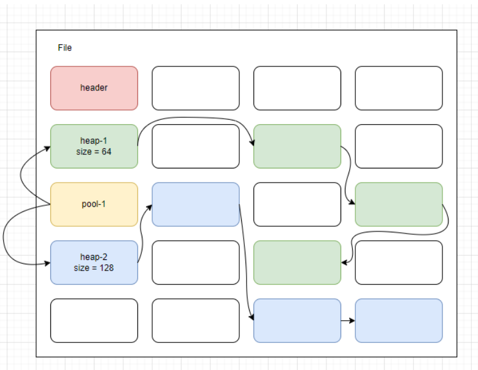

# Relational Database Management System

## Modules

- core - file management functionality
- parser - syntactic analysis of query language
- util - utility data structures and definitions

## File data structures

## Performance tests

Delete O(n)

Select O(n)

Select with single Join O(n^2)

Update O(n)

Insert O(1)

